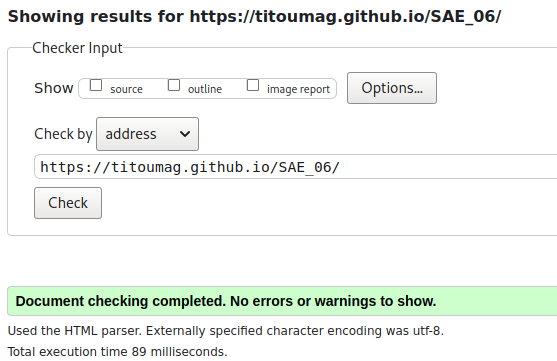
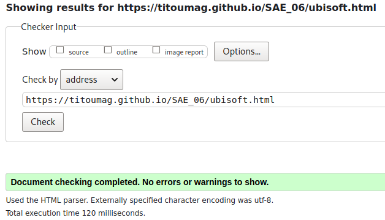
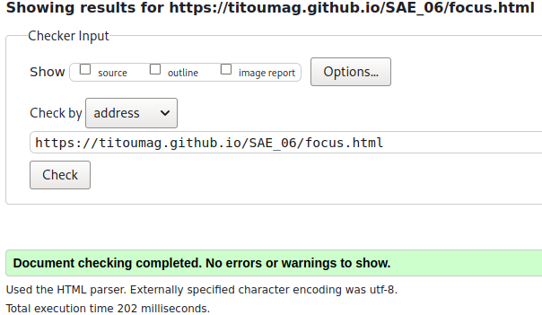
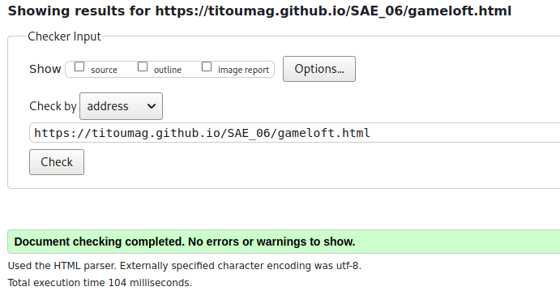
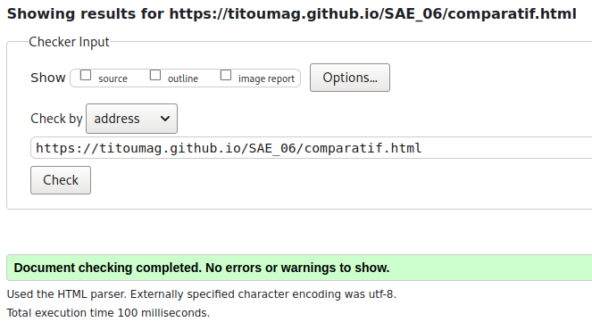

# SAE 06

<h2>
Le but du projet est d'étudier 3 studios de jeux vidéos et les comparer dans leur aspect économique.
</h2>

  
  
  

Membres du groupe :

[Julien Oudot](mailto:julien.oudot03@edu.univ-fcomte.fr?subject=[GitHub])
Titouan MAGNIN 
Titouan Nicot 
Lilian Schott

# Répartitions des taches

Ecran de Zoning réalisé par Titouan NICOT. 
Chaque membre du groupe a réalisé la page lié à la partie qu'il a écrit dans le rapport économique :
 
Julien OUDOT - Ubisoft,
 
Tiouan MAGNIN - Gameloft,
 
Titouan NICOT - Focus Entertainment,
 
Lilian SCHOTT - Comparatif.
 

La page d'acceuil a été réalisé par tout les membres.

# Documents

[Doc PDF](doc/JulienOUDOT_S1B2_SAE106_rapport_comparatif.pdf)

# Validation des pages 

