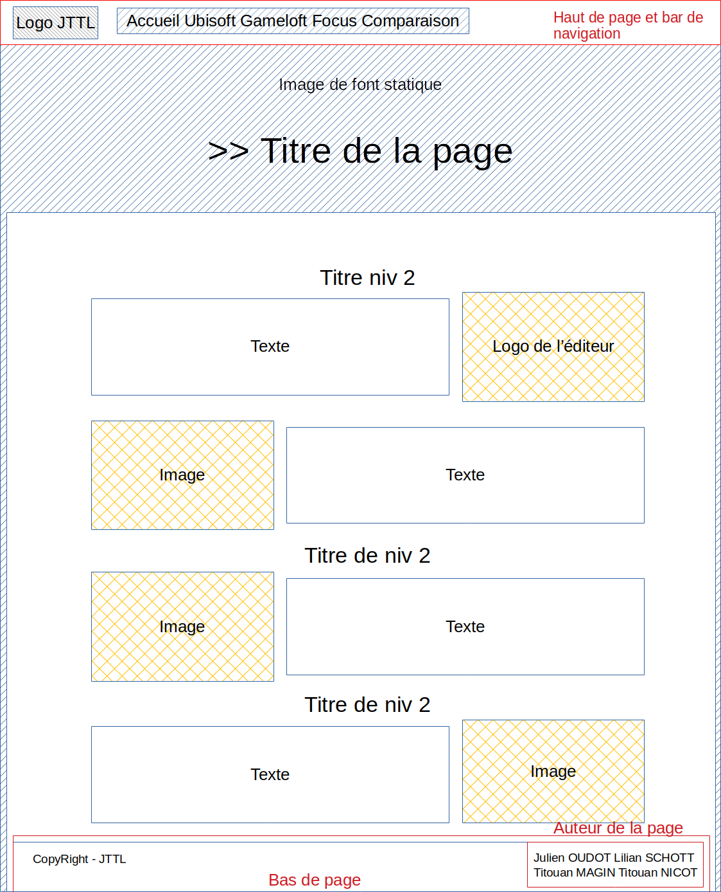
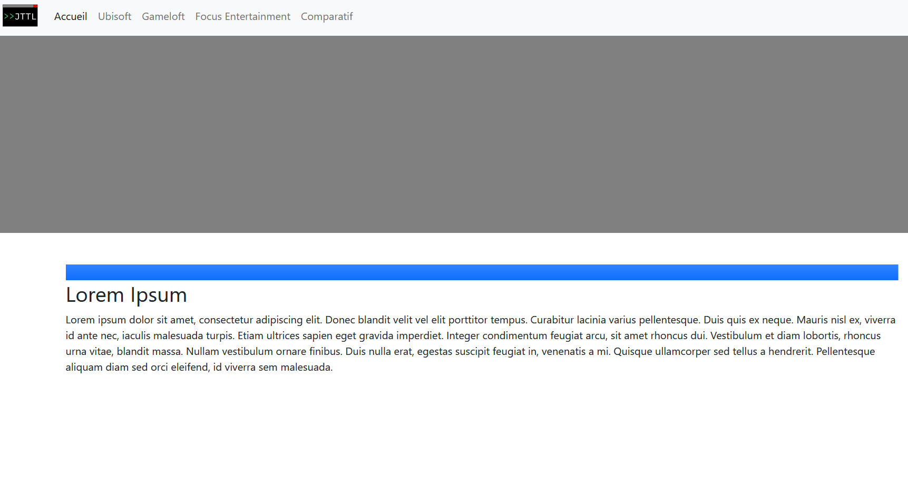

# SAE 06

<h2>
Le but du projet est d'étudier 3 studios de jeux vidéos et les comparer.
</h2>

  
  
  

Membres du groupe :

[Julien Oudot](mailto:julien.oudot03@edu.univ-fcompte.fr?subject=[GitHub])
Titouan MAGNIN 
Titouan Nicot 
Lilian Schott

[Doc PDF](doc/JulienOUDOT_S1B2_SAE106_rapport_comparatif.pdf)
